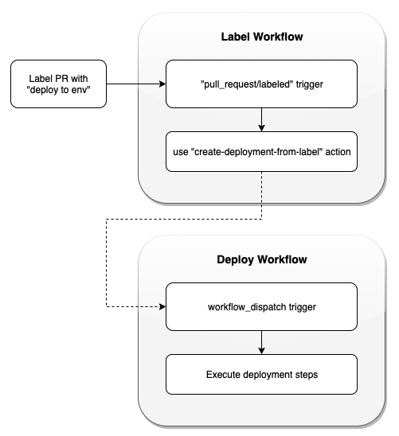
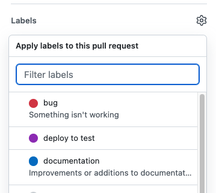
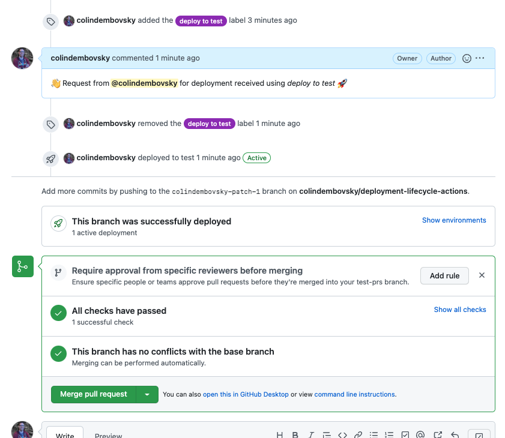
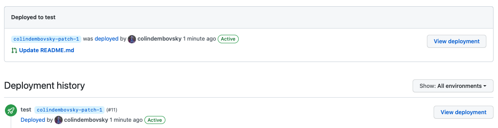
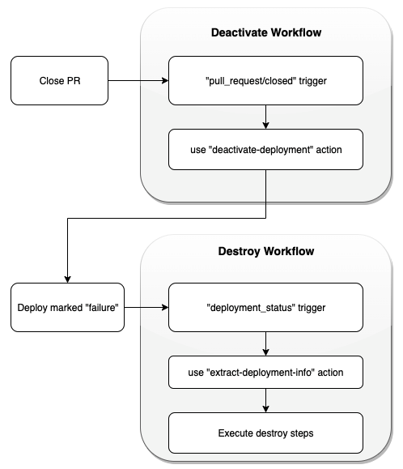
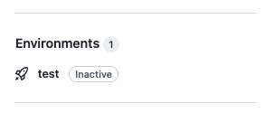
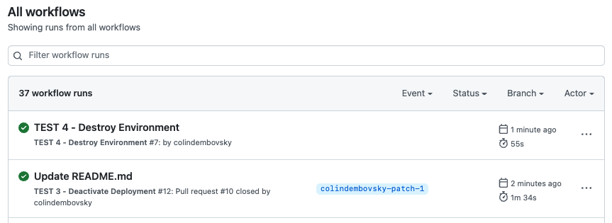

 [](https://github.com/colindembovsky/deployment-lifecycle-actions/LICENSE)

# Deployment Lifecycle Actions

Managing deployments via PR is good practice and is a central tenet to GitHub flow. However, practically managing deployments is non-trivial. The Actions in this repo coupled with four workflow templates will give you a complete deployment management solution.

A huge thank you to my colleague [Peter Murray](https://github.com/peter-murray) for the guts of the code in the Actions!

## Overview

The process is triggered by adding a `deploy to <environment>` label to the PR. Automation processes the label and triggers a deployment workflow with your deployment steps. This creates a deployment which you will see in the PR. Once the PR is closed, the deployment is marked as inactive and a destroy workflow is invoked to clean up resources.

The Actions in this repo wrap the heavy-lifting for you. There are four workflows involved:

Workflow|Trigger|Action Used|Parameters
--|--|--|--
`Label Deployment`|When a label is added to the PR|[colindembovsky/deployment-lifecycle-actions/create-deployment-from-label](create-deployment-from-label/action.yml)|<ul><li>The name of the deployment workflow</li><li>Deployment token (optional)</li></ul>
`Deployment`|Triggered by the `Label Deployment` workflow|_None_|_None_
`Deactivate Deployment`|When the PR is closed|[colindembovsky/deployment-lifecycle-actions/deactivate-deployment](deactivate-deployment/action.yml)|_None_
`Destroy Environment`|When a deployment is set to `failure`|[colindembovsky/deployment-lifecycle-actions/extract-deployment-info](extract-deployment-info/action.yml)|_None_

### Deployment Phase

The deployment works as follows:



1. A PR is created as usual.
1. When ready to deploy, someone adds a `deploy to <environment>` label to the PR to deploy to the `<environment>` environment:

    
    
1. The `Label Deployment` workflow triggers when the label is added.
    - This workflow uses `colindembovsky/deployment-lifecycle-actions/create-deployment-from-label`
        - The Action first extracts the environment name (`dev` from `deploy to dev` for example) based on a customizable regex pattern
        - The Action then invokes the `Deployment workflow` passing in the `environment` and any other inputs
1. The `Deployment` workflow triggers.
    - This workflow performs your deployment steps in the environment
    - This automatically creates a `deployment` object that you will see in the PR:
        
    - You will also see the deployment in the Environments page:
        

### Deployment Phase

When the PR is closed, the deactivate phase is as follows:



1. The PR close event triggers the `Deactivate Deployment` workflow.
    - This workflow uses `colindembovsky/deployment-lifecycle-actions/deactivate-deployment`
        - The Action first transitions the deployment to `failure` to trigger the next workflow due to [this limitation](https://docs.github.com/en/actions/using-workflows/events-that-trigger-workflows#deployment_status)
        - The Action then transitions the deployment to `inactive`

            

1. The `Destroy Environment` workflow triggers off the deployment status change.
    - This workflow uses `colindembovsky/deployment-lifecycle-actions/extract-deployment-info` to get the `ref` and `environment` and sets them as outputs
    - Your custom teardown steps are added after this
       
        

## The Workflows

### 1. Label Deployment Workflow

Use this to trigger the process. You need to know the name of the workflow you want to trigger to do the actual deployments and any additional inputs.

```yml
name: Label deployment trigger

# mandatory to trigger correctly
on:
  pull_request:
    types:
      - labeled

jobs:
  deployment:
    name: Create deployment
    runs-on: ubuntu-20.04
    # filter on the 'deploy to x' labels - customize for your environment names
    if: |
      github.event.label.name == 'deploy to test' ||
      github.event.label.name == 'deploy to staging' ||
      github.event.label.name == 'deploy to qa'
    
    steps:
    - name: Checkout Sources
      uses: actions/checkout@v3

    - name: Create deployment from label
      id: create-deploy
      uses: colindembovsky/deployment-lifecycle-actions/create-deployment-from-label@v1
      with:
        # this is the name of the yml file in your .github/workflows/ folder that you want to trigger
        # to run the deployment steps. The workflow must expect at least 1 input called 'environment'
        deployment-workflow-name: TEST-2-DeployEnvironment.yml
        # optional: use a json format to pass additional inputs
        additional-inputs-json: '{ "url": "https://another-test-url" }'
        # GITHUB_TOKEN will work - but you can provide another token if needed
        # token: ${{ secrets.DEPLOY_TOKEN }}
    
    # access the outputs of the create-deployment-from-label step
    - name: Dump env name
      run: echo $ENV
      env:
         ENV: ${{ steps.create-deploy.outputs.environment }}
```

### 2. Deployment Workflow

You use this to run your deployment steps. No custom actions are needed! The only requirement is that you have an `environment` input and any optional additional inputs, which you need to specify in the previous workflow.

```yml
name: Deploy Environment

on:
  # this is triggered by the 'Label Deployment' workflow
  workflow_dispatch:
    inputs:
      # this is mandatory
      environment:
        description: The name of the environment to be deployed
        required: true
      # other inputs can be passed using 'additional-inputs-json' in the 'Label Deployment' workflow
      url:
        description: The URL of the environment
        required: false
        default: https://test

jobs:
  deploy:
    name: Deploy to Environment
    runs-on: ubuntu-20.04

    # mandatory to actually create a deployment object
    environment:
      # access the input values using ${{ github.event.inputs }}
      name: ${{ github.event.inputs.environment }}
      url: ${{ github.event.inputs.url }}

    # add your deployment steps here
    steps:
      - name: Deploy steps!
        run: echo "Deploying the app!"
```

### 3. Deactivate Deployment Workflow

No customization needed here, so just copy it as-is. This simply marks the deployment in the PR as inactive, which triggers the `Destroy environment` workflow.

```yml
name: Deactivate Deployment

on:
  pull_request:
    types:
      - closed

jobs:
  clean:
    name: Cleanup Review environments
    runs-on: ubuntu-20.04

    steps:
    - name: Checkout
      uses: actions/checkout@v3

    - name: Mark environments as inactive in GitHub
      uses: colindembovsky/deployment-lifecycle-actions/deactivate-deployment@v1
```

### 4. Destroy Environment Workflow

This workflow uses the `extract-deployment-info` action to extract the `ref` and `environment` that has been deactivated. Then perform any applicable cleanup steps.

```yml
name: Destroy Environment

# mandatory
on:
  deployment_status

jobs:
  destroy:
    name: Destroy a deployment environment
    # mandatory to filter correctly - you don't want to run this on 'activate' for example
    if: github.event.deployment_status.state == 'failure'
    runs-on: ubuntu-20.04

    steps:
    - name: Checkout Sources
      uses: actions/checkout@v3

    # extract the 'ref' and 'environment' as outputs
    - name: Extract Deployment Details and Report Deployment in Progress
      id: deployment_data
      uses: colindembovsky/deployment-lifecycle-actions/extract-deployment-info@v1
    
    # implement tear-down steps here, accessing the outputs from the previous step
    - name: Destroy environment
      run: |
        echo Environment name is $ENV_NAME
        echo Ref is $REF
      env:
        REF: ${{ steps.deployment_data.outputs.deployment_ref }}
        ENV_NAME: ${{ steps.deployment_data.outputs.environment }}
```
